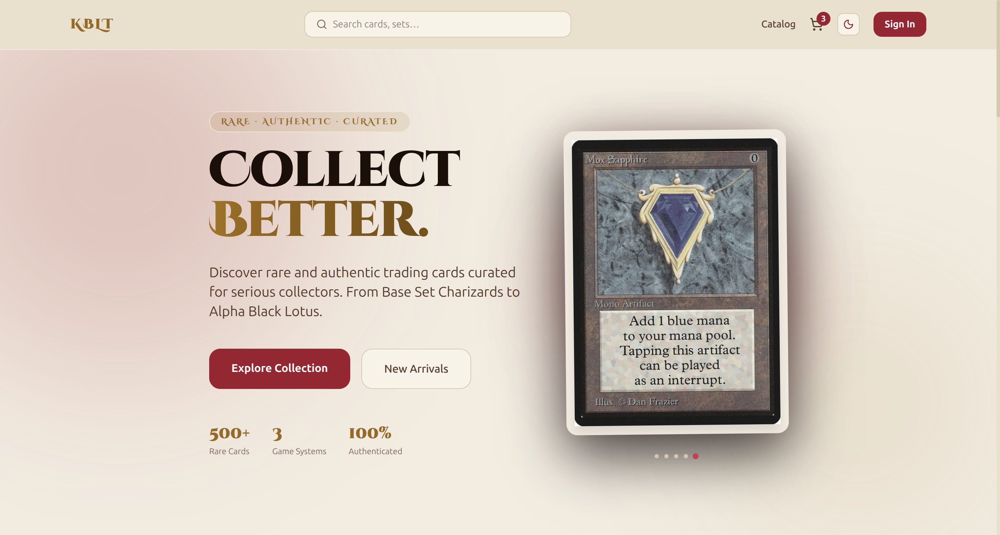
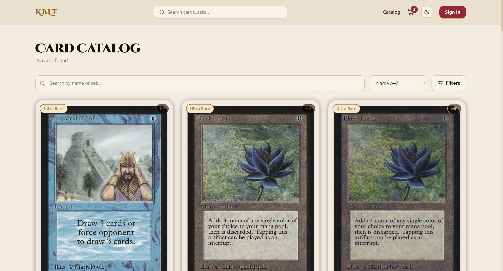
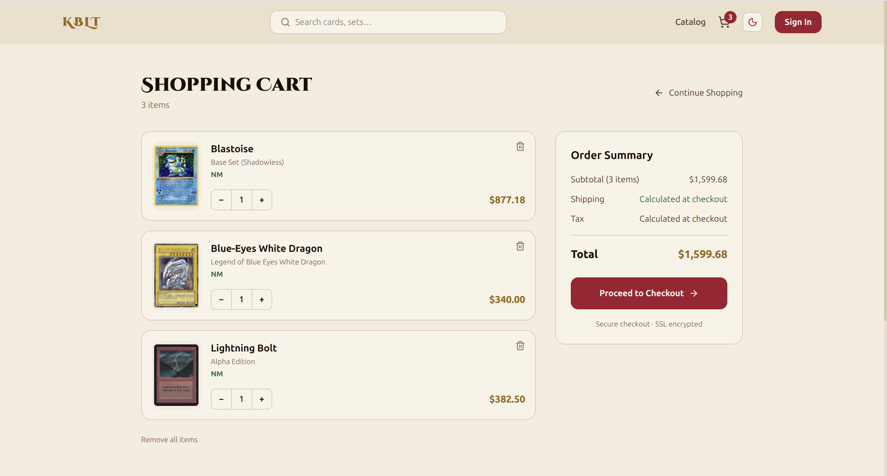

# P-o-C FullStack Learning Journey & Portfolio

# KBLT — Kobold Tavern

> A full-stack trading card ecommerce platform for serious collectors. Built as a portfolio project to demonstrate end-to-end software engineering across frontend, backend, cloud infrastructure, and DevOps.

**Live Demo → [koboldtavern.vercel.app](https://koboldtavern.vercel.app)**

---

## Screenshots


*Hero section with rotating featured card carousel*


*Card catalog with real-time filtering and sorting across 26 products*


*Shopping cart with Redis-backed state and optimistic UI updates*

---

## Architecture

```
┌─────────────────────────────────────────────────────────┐
│                        Vercel                           │
│              Next.js 15 (Frontend)                      │
│     Server Components · Zustand · Tailwind CSS          │
└──────────────────────────┬──────────────────────────────┘
                           │ HTTPS
┌──────────────────────────▼──────────────────────────────┐
│                       Railway                           │
│              Fastify API (Docker Container)             │
│      JWT Auth · Rate Limiting · Input Validation        │
│                          │                              │
│                    Redis (Cache)                        │
│         Cart State · Token Blacklist · Rate Limits      │
└──────────────────────────┬──────────────────────────────┘
                           │
┌──────────────────────────▼──────────────────────────────┐
│                      Supabase                           │
│            PostgreSQL (via Prisma ORM)                  │
│         Products · Users · Orders · Addresses           │
│                  Storage (Card Images CDN)              │
└─────────────────────────────────────────────────────────┘
```

---

## Tech Stack

### Frontend
- **Next.js 15** — App Router, async server components, dynamic rendering
- **TypeScript** — end-to-end type safety across API boundaries
- **Tailwind CSS** — utility-first styling with custom CSS variables
- **Zustand** — client state management for cart and auth
- **next/image** — optimized image delivery from Supabase Storage CDN

### Backend
- **Fastify** — high-performance Node.js web framework
- **Prisma** — type-safe ORM with PostgreSQL
- **Redis (ioredis)** — cart persistence, token blacklist, rate limit counters
- **@fastify/jwt** — JWT authentication with token blacklisting on logout
- **@fastify/rate-limit** — tiered rate limiting backed by Redis

### Infrastructure
- **Vercel** — frontend hosting with automatic CI/CD on git push
- **Railway** — containerized API hosting with automatic deploys
- **Supabase** — managed PostgreSQL with connection pooling (PgBouncer) and Storage CDN
- **Docker** — multi-stage production builds targeting Alpine Linux

> This project is a **proof of concept**. AWS infrastructure (ECS Fargate, ECR, ElastiCache, CodePipeline) was designed and documented as a reference for a production-scale deployment but was not used in this project.

---

## Features

### Authentication
- JWT-based auth with 7-day expiry
- Token blacklisting on logout via Redis — invalidated tokens can't be reused
- Protected routes redirect unauthenticated users

### Product Catalog
- 26 trading cards across Pokémon, Yu-Gi-Oh!, and Magic: The Gathering
- Real-time filtering by game, rarity, and condition
- Full-text search across card name and set
- Server-side rendering with `force-dynamic` for always-fresh data

### Cart
- Redis-backed cart state persisted across sessions and devices
- Optimistic UI updates with rollback on failure
- Soft stock reservation — warns when other users have items in their cart
- Cart syncs immediately on login

### Checkout & Orders
- Saved address management (create, update, set default, delete)
- Atomic order placement — stock decrement and order creation in a single Prisma transaction
- `priceAtTime` snapshot prevents price changes from affecting historical orders
- Cart cleared only after successful transaction commit

### API Hardening (V3)
- **Input validation** — JSON Schema on all routes including params, querystring bounds (`limit` max 100, `page` min 1), and body `minProperties`
- **Rate limiting** — auth endpoints (5 req / 15 min), order placement (10 req / min), global fallback (300 req / min)
- **Global error handler** — normalizes all errors including Fastify schema failures, JWT errors, and unhandled exceptions to `{ statusCode, error }`
- **Structured logging** — Pino with request serializers that whitelist safe fields, preventing JWT tokens from appearing in logs. Request ID correlation links errors to their triggering request in CloudWatch

---

## Project Structure

```
aws-learning-journey/
├── apps/
│   ├── frontend/
│   │   └── kblt-frontgate/          # Next.js 15 application
│   │       ├── app/
│   │       │   ├── components/      # Server and client components
│   │       │   ├── store/           # Zustand stores (auth, cart)
│   │       │   ├── lib/             # API client, typed API modules
│   │       │   └── (routes)/        # catalog, product, checkout, profile
│   │       └── next.config.js
│   │
│   └── backend/
│       └── kblt-api/                # Fastify API
│           ├── src/
│           │   ├── plugins/         # prisma, redis, jwt, errorHandler, rateLimit
│           │   ├── routes/          # auth, users, addresses, products, cart, orders
│           │   └── lib/             # schemas, stock helpers
│           ├── prisma/
│           │   ├── schema.prisma
│           │   └── seed.ts
│           └── Dockerfile
│
├── docker-compose.yml               # Local development stack
├── buildspec.yml                    # AWS CodeBuild spec (reference)
├── ecs-task-definition.json         # AWS ECS task definition (reference)
└── AWS-DEPLOYMENT.md                # Full AWS deployment guide
```

---

## Local Development

### Prerequisites
- Node.js 20+
- Docker and Docker Compose
- A Supabase project

### Backend

```bash
cd apps/backend/kblt-api

# Install dependencies
npm install

# Set up environment variables
cp .env.example .env
# Fill in DATABASE_URL, DIRECT_URL, REDIS_URL, JWT_SECRET

# Generate Prisma client and run migrations
npx prisma migrate dev
npx prisma db seed

# Start Redis via Docker
docker compose up redis

# Start the API with hot reload
npm run dev
```

API runs at `http://localhost:3001`

### Frontend

```bash
cd apps/frontend/kblt-frontgate

# Install dependencies
npm install

# Set up environment variables
cp .env.example .env.local
# Fill in NEXT_PUBLIC_API_URL and API_URL

# Start the dev server
npm run dev
```

Frontend runs at `http://localhost:3000`

### Full stack via Docker

```bash
# From the monorepo root
docker compose up --build
```

---

## Environment Variables

### Backend (`apps/backend/kblt-api/.env`)

| Variable | Description |
|---|---|
| `DATABASE_URL` | Supabase pooled connection string (port 6543) |
| `DIRECT_URL` | Supabase direct connection string (port 5432) |
| `REDIS_URL` | Redis connection string |
| `JWT_SECRET` | Secret key for signing JWTs |
| `JWT_EXPIRES_IN` | Token expiry duration (default: `7d`) |
| `CORS_ORIGIN` | Allowed frontend origin |
| `PORT` | API port (default: `3001`) |
| `NODE_ENV` | `development` or `production` |

### Frontend (`apps/frontend/kblt-frontgate/.env.local`)

| Variable | Description |
|---|---|
| `NEXT_PUBLIC_API_URL` | API base URL for browser requests |
| `API_URL` | API base URL for server component requests |

---

## API Reference

| Method | Endpoint | Auth | Description |
|---|---|---|---|
| POST | `/auth/register` | — | Create account |
| POST | `/auth/login` | — | Login, returns JWT |
| POST | `/auth/logout` | ✓ | Blacklist token |
| GET | `/users/me` | ✓ | Get current user |
| PATCH | `/users/me` | ✓ | Update name or email |
| GET | `/products` | — | List products with filters |
| GET | `/products/featured` | — | Featured products |
| GET | `/products/:id` | — | Product detail with stock info |
| GET | `/cart` | ✓ | Get cart with product details |
| POST | `/cart/items` | ✓ | Add item to cart |
| PATCH | `/cart/items/:productId` | ✓ | Update quantity |
| DELETE | `/cart/items/:productId` | ✓ | Remove item |
| DELETE | `/cart` | ✓ | Clear cart |
| GET | `/users/me/addresses` | ✓ | List saved addresses |
| POST | `/users/me/addresses` | ✓ | Add address |
| PATCH | `/users/me/addresses/:id` | ✓ | Update address |
| DELETE | `/users/me/addresses/:id` | ✓ | Delete address |
| PUT | `/users/me/addresses/:id/default` | ✓ | Set default address |
| POST | `/orders` | ✓ | Place order from cart |
| GET | `/orders` | ✓ | Order history |
| GET | `/orders/:id` | ✓ | Order detail |
| GET | `/health` | — | Health check |

---

## AWS Deployment (Future Reference)

This project was designed with a production AWS architecture in mind. The repository includes [`AWS-DEPLOYMENT.md`](./AWS-DEPLOYMENT.md) documenting a full ECS Fargate deployment as a reference for scaling this project beyond a proof of concept. It covers:

- ECS Fargate — containerized API with auto-scaling
- ECR — private Docker image registry
- ElastiCache — managed Redis replacing Railway's Redis
- Secrets Manager — secure environment variable storage
- Application Load Balancer — HTTPS termination
- CodePipeline → CodeBuild — full CI/CD on git push

This was not implemented in the current deployment but represents the intended production architecture.

---

## Author

**Fabian M.V** — [@Inm0rt4LKoff33](https://github.com/Inm0rt4LKoff33)
